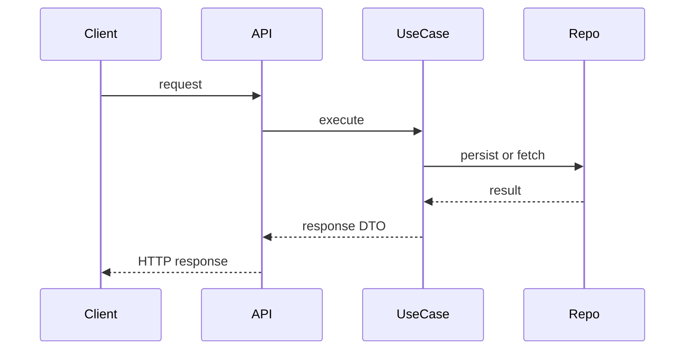

# [Architecture Topic]

> Use este template para qualquer documento em `.docs/architecture/`.
> Regra: nenhum arquivo desta camada deve ser criado fora deste padrao.
> Naming: use `kebab-case` por fluxo ou visao tecnica, por exemplo `flows.md`, `sequence.md` ou `credit-card-billing.md`.

## Status

- [ ] Draft
- [ ] In Review
- [ ] Approved

## Purpose

[Qual fluxo, sequencia ou visao arquitetural este documento explica.]

## Scope

[Quais camadas, modulos e pontos de integracao entram neste documento.]

## Sources of Truth

- Spec:
- Task:
- ADRs:
- Code:
- Related docs:

## Overview

[Resumo do fluxo ou da decisao tecnica.]

## Actors and Components

| Component | Responsibility | Layer | Notes |
| --------- | -------------- | ----- | ----- |
|           |                |       |       |

## Entry Points

- 

## Main Flow

1. 
2. 
3. 

## Sequence Diagram

## Failure Modes and Recovery

| Failure | Detection | Recovery |
| ------- | --------- | -------- |
|         |           |          |

## Caching and Consistency

- Cache or snapshot behavior:
- Invalidation strategy:
- Consistency boundaries:

## Security and Multi-tenant Notes

- 

## Observability

- Logs:
- Metrics:
- Manual validation:

## Open Questions

- 
