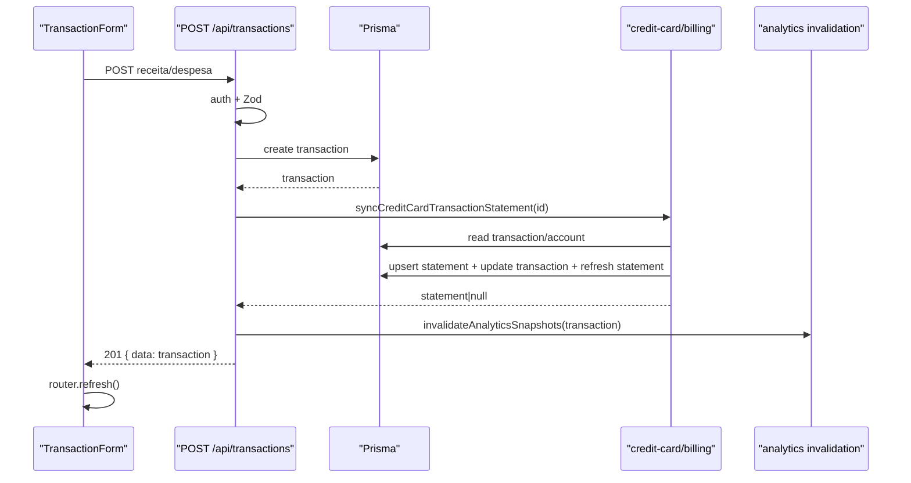
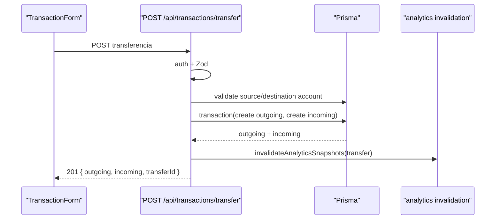
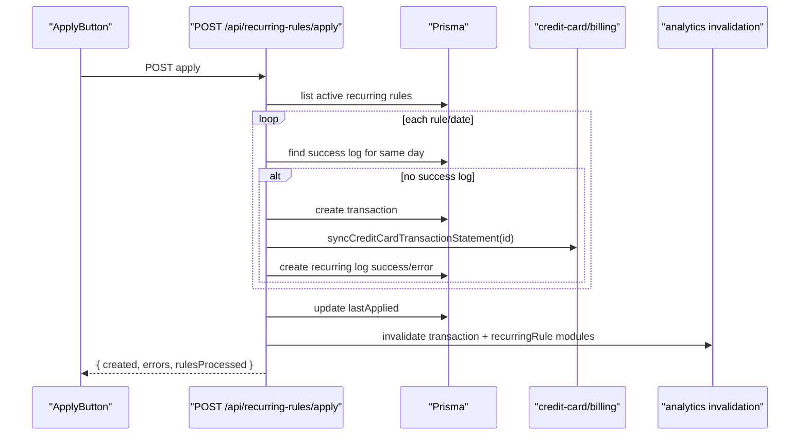
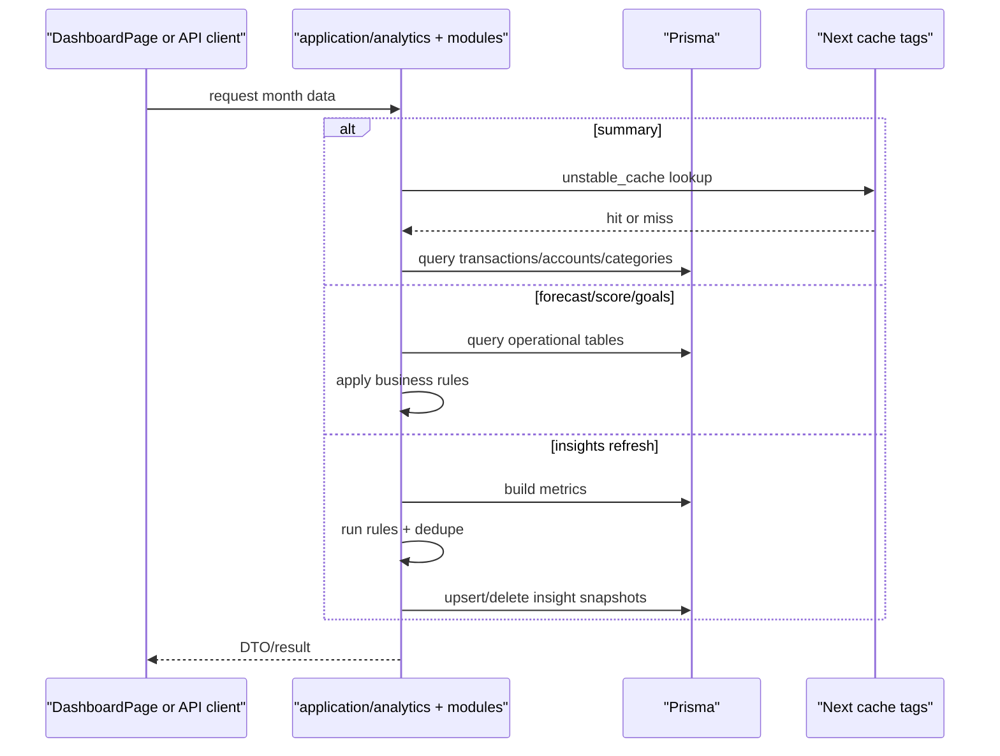
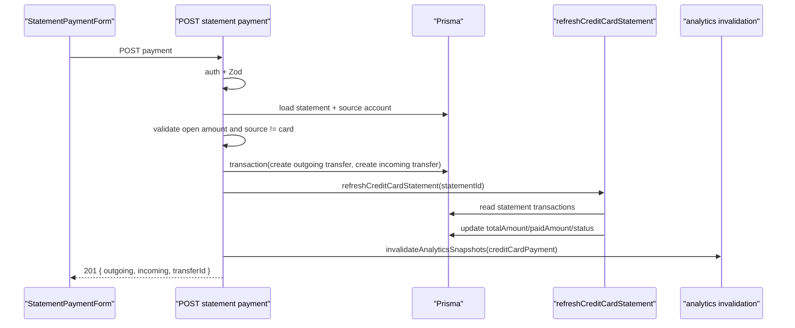

# [Architecture Topic]

## Status

- [ ] Draft
- [ ] In Review
- [x] Approved

## Purpose

Documentar os fluxos criticos implementados hoje no Finance Controller, ligando UI, Route Handlers, use cases, Prisma e mecanismos de cache/snapshot.

## Scope

Cobrir os fluxos reais de criacao de transacao, transferencia entre contas, aplicacao de recorrencias, calculo analitico com cache/snapshots e billing de cartao com pagamento de fatura.

## Sources of Truth

- Spec: `.docs/future-features/17-docs-architecture-flows.md`
- Task: `.docs/tasks/phase-25-architecture-flows.md`
- ADRs:
  - `.docs/decisions/ADR-004-transfer-strategy.md`
  - `.docs/decisions/ADR-006-recurring-rules.md`
  - `.docs/decisions/ADR-008-credit-card-billing-cycle.md`
  - `.docs/decisions/ADR-009-analytics-snapshot-invalidation.md`
  - `.docs/decisions/ADR-010-goal-engine.md`
  - `.docs/decisions/ADR-011-forecast-engine.md`
  - `.docs/decisions/ADR-012-financial-score.md`
  - `.docs/decisions/ADR-013-automatic-insights.md`
- Code:
  - `src/app/(app)/transactions/page.tsx`
  - `src/app/(app)/transactions/transaction-form.tsx`
  - `src/app/(app)/recurring/apply-button.tsx`
  - `src/app/(app)/dashboard/page.tsx`
  - `src/app/(app)/credit-cards/[id]/statement-payment-form.tsx`
  - `src/app/api/transactions/route.ts`
  - `src/app/api/transactions/transfer/route.ts`
  - `src/app/api/recurring-rules/apply/route.ts`
  - `src/app/api/analytics/summary/route.ts`
  - `src/app/api/analytics/forecast/recalculate/route.ts`
  - `src/app/api/analytics/insights/recalculate/route.ts`
  - `src/app/api/credit-cards/statements/[id]/payments/route.ts`
  - `src/server/modules/finance/application/analytics/`
  - `src/server/modules/finance/application/credit-card/billing.ts`
  - `src/server/modules/finance/application/forecast/calculate-forecast.ts`
  - `src/server/modules/finance/application/score/calculate-score.ts`
  - `src/server/modules/finance/application/insights/use-cases.ts`
- Related docs:
  - `.docs/api/transactions.md`
  - `.docs/api/analytics.md`
  - `.docs/api/goals.md`
  - `.docs/data/data-dictionary.md`

## Overview

A arquitetura alvo continua sendo em camadas, mas a implementacao atual mistura dois estilos.

- Alguns fluxos ja usam bem a camada `application`, como forecast, score, insights, billing de cartao e parte de analytics.
- Outros ainda concentram orquestracao em `route.ts`, principalmente transacoes, transferencias, recorrencias e pagamento de fatura.
- A UI server-side tambem nao passa sempre pela API: a dashboard carrega varios dados chamando use cases diretamente no Server Component, enquanto formulários client-side usam `fetch()` para as rotas HTTP.

## Actors and Components

| Component                            | Responsibility                                            | Layer       | Notes                                         |
| ------------------------------------ | --------------------------------------------------------- | ----------- | --------------------------------------------- |
| `transaction-form.tsx`               | Coleta dados de receita/despesa/transferencia e chama API | UI client   | Converte valor em reais para centavos         |
| `TransactionsPage`                   | Lista transacoes com Prisma direto                        | UI server   | Bypassa a API para leitura                    |
| `ApplyButton`                        | Dispara aplicacao manual de recorrencias                  | UI client   | Chama `POST /api/recurring-rules/apply`       |
| `DashboardPage`                      | Agrega analytics, metas, forecast, score e insights       | UI server   | Chama use cases diretamente                   |
| `StatementPaymentForm`               | Dispara pagamento de fatura                               | UI client   | Chama rota HTTP de billing                    |
| `route.ts` em `src/app/api/**`       | Auth, validacao, orchestration e resposta HTTP            | API         | Alguns handlers ainda acumulam muita regra    |
| `application/analytics/*`            | Summary, cache por tags, period helpers e invalidation    | Application | Base compartilhada entre UI e API             |
| `application/credit-card/billing.ts` | Vinculo transacao-fatura e refresh de fatura              | Application | Reutilizado em mutacoes                       |
| `application/goals/*`                | Calculo e snapshot de metas                               | Application | Listagem da dashboard usa direto              |
| `application/forecast/*`             | Calculo e persistencia do forecast                        | Application | Usado por dashboard e API                     |
| `application/score/*`                | Calculo e persistencia do score                           | Application | Depende de goals e credit card                |
| `application/insights/*`             | Metric pipeline, regras, dedupe e persistencia            | Application | Reutilizado por dashboard e API               |
| `prisma`                             | Persistencia e transacoes SQL                             | Infra       | Acesso direto ainda aparece em pages e routes |

## Entry Points

- UI server:
  - `src/app/(app)/dashboard/page.tsx`
  - `src/app/(app)/transactions/page.tsx`
- UI client:
  - `src/app/(app)/transactions/transaction-form.tsx`
  - `src/app/(app)/recurring/apply-button.tsx`
  - `src/app/(app)/credit-cards/[id]/statement-payment-form.tsx`
- API:
  - `POST /api/transactions`
  - `POST /api/transactions/transfer`
  - `POST /api/recurring-rules/apply`
  - `GET /api/analytics/summary`
  - `POST /api/analytics/forecast/recalculate`
  - `POST /api/analytics/insights/recalculate`
  - `POST /api/credit-cards/statements/[id]/payments`

## Main Flow

1. A UI client envia `fetch()` para uma rota mutadora quando o usuario cria dados ou executa uma acao operacional.
2. O handler autentica, valida o payload e costuma orquestrar Prisma + use cases auxiliares.
3. Mutacoes financeiras relevantes sincronizam billing de cartao quando necessario e chamam `invalidateAnalyticsSnapshots()`.
4. Leituras analiticas seguem dois caminhos:
   - UI server-side chama use cases diretamente.
   - API publica chama os mesmos modulos, com cache apenas no summary.
5. Forecast, score, goals e insights podem ser calculados on-demand; alguns endpoints adicionais persistem snapshots explicitamente.

## Flow 1: Criacao De Transacao

### Overview

Receita e despesa nascem no dialog client-side de transacoes, passam por `POST /api/transactions`, podem sincronizar uma fatura de cartao e invalidam todos os modulos analiticos afetados.

### Main Flow

1. `TransactionForm` coleta os campos e converte `R$` para centavos.
2. O componente chama `POST /api/transactions`.
3. O handler executa `requireAuth()`, valida com `createTransactionSchema` e verifica ownership de conta/categoria.
4. A rota persiste `prisma.transaction.create(...)`.
5. Em seguida chama `syncCreditCardTransactionStatement(transaction.id)`.
6. O módulo de billing:
   - carrega a transacao e a conta;
   - ignora transacoes que nao sao `EXPENSE`, nao sao cartao configurado ou fazem parte de transferencia;
   - cria ou reaproveita a fatura correta por ciclo;
   - atualiza `creditCardStatementId` da transacao;
   - recalcula `totalAmount`, `paidAmount` e `status` da fatura.
7. A rota chama `invalidateAnalyticsSnapshots(...)` com os modulos de `transaction`.
8. O cliente faz `router.refresh()` e a page server-side recarrega os dados.

### Sequence Diagram

### Failure Modes and Recovery

| Failure                                                     | Detection                  | Recovery                          |
| ----------------------------------------------------------- | -------------------------- | --------------------------------- |
| Conta inexistente ou de outro usuario                       | Handler retorna `400`      | Usuario corrige selecao           |
| Categoria invalida                                          | Handler retorna `400`      | Usuario corrige selecao           |
| JSON invalido ou erro inesperado                            | Handler retorna `500`      | Retry manual                      |
| Fatura nao sincroniza por conta nao configurada como cartao | Sem erro; `statement=null` | Fluxo segue como transacao normal |

### Caching and Consistency

- Cache or snapshot behavior: a rota responde com a transacao criada antes de refletir eventual `creditCardStatementId` final no payload devolvido.
- Invalidation strategy: invalida `summary`, `goals`, `forecast`, `score`, `insights` e `credit-card`.
- Consistency boundaries: persistencia da transacao e sincronizacao de billing nao estao dentro de uma unica transacao SQL de alto nivel.

### Security and Multi-tenant Notes

- Conta e categoria sao validadas com `id + userId`.
- A transacao criada sempre recebe `userId` da sessao.

## Flow 2: Transferencia Entre Contas

### Overview

Transferencia usa um handler dedicado e modela o evento como duas linhas `TRANSFER` ligadas por `transferId`, sem use case intermediario.

### Main Flow

1. `TransactionForm` entra em modo `transfer`.
2. O cliente chama `POST /api/transactions/transfer`.
3. O handler autentica, valida com `createTransferSchema` e carrega conta de origem e destino do usuario.
4. Gera `transferId = crypto.randomUUID()`.
5. Usa `prisma.$transaction([...])` para criar dois registros:
   - saida na conta de origem;
   - entrada na conta de destino.
6. Nao existe categoria nem billing associado.
7. O handler invalida analytics com `ANALYTICS_MUTATION_MODULES.transfer`.
8. O cliente faz `router.refresh()`.

### Sequence Diagram

### Failure Modes and Recovery

| Failure                                               | Detection                         | Recovery                    |
| ----------------------------------------------------- | --------------------------------- | --------------------------- |
| Conta de origem/destino nao pertence ao usuario       | `400`                             | Ajustar formulario          |
| Falha ao criar um dos lancamentos                     | Rollback do `prisma.$transaction` | Retry manual                |
| Transferencia indevida para o mesmo contexto contábil | Sem bloqueio adicional na rota    | Regra depende da UI/usuario |

### Caching and Consistency

- Cache or snapshot behavior: nao gera snapshots diretamente.
- Invalidation strategy: invalida `summary`, `forecast`, `score`, `insights` e `credit-card`, mas nao `goals`.
- Consistency boundaries: as duas linhas da transferencia sao atomicas entre si via `prisma.$transaction`.

### Security and Multi-tenant Notes

- Ambas as contas sao verificadas com `userId`.
- `transferId` nao e FK, e apenas correlacao logica.

## Flow 3: Aplicacao De Recorrencias

### Overview

O fluxo de recorrencias hoje ainda vive quase inteiro em `POST /api/recurring-rules/apply`. O handler calcula datas pendentes, evita duplicacao via log e cria transacoes uma a uma.

### Main Flow

1. `ApplyButton` chama `POST /api/recurring-rules/apply`.
2. O handler autentica e carrega todas as `RecurringRule` ativas do usuario.
3. Para cada regra, calcula datas pendentes com `getNextDates(rule)`.
4. Para cada data:
   - consulta `RecurringLog` para ver se ja existe sucesso naquele dia;
   - se nao existir, cria uma transacao;
   - chama `syncCreditCardTransactionStatement(transaction.id)`;
   - grava `RecurringLog` com `status: 'success'`;
   - em erro, grava `RecurringLog` com `status: 'error'`.
5. Ao final de cada regra, atualiza `lastApplied`.
6. Se houve transacoes criadas, invalida analytics do tipo `transaction`.
7. Se houve datas processadas de regra, invalida analytics do tipo `recurringRule`.
8. O cliente mostra o resumo e faz `router.refresh()`.

### Sequence Diagram

### Failure Modes and Recovery

| Failure                               | Detection                                    | Recovery                                                   |
| ------------------------------------- | -------------------------------------------- | ---------------------------------------------------------- |
| Regra invalida para a data/frequencia | Data nao entra em `getNextDates`             | Nenhuma acao necessaria                                    |
| Erro ao criar transacao de uma data   | Catch local cria log `error`                 | Fluxo continua com outras datas/regras                     |
| Reaplicacao duplicada                 | `RecurringLog` com `status='success'` no dia | Data e ignorada                                            |
| Explosao de backlog historico         | Hard cap de 365 datas por regra              | Evita loop infinito, mas pode truncar backlog muito antigo |

### Caching and Consistency

- Cache or snapshot behavior: o apply nao persiste snapshots diretamente; apenas marca analytics para recálculo futuro.
- Invalidation strategy:
  - `transaction` quando houve criacao de transacoes;
  - `recurringRule` quando houve processamento/avanco de regras.
- Consistency boundaries: o fluxo inteiro nao e uma transacao unica; cada data processada pode ter sucesso ou erro isoladamente.

### Security and Multi-tenant Notes

- O handler filtra regras por `userId`.
- `RecurringLog` herda ownership via `RecurringRule`.

## Flow 4: Analytics, Cache E Snapshots

### Overview

Analytics usa uma combinacao de leitura on-demand, cache por tags e snapshots persistidos opcionais. A dashboard server-side chama varios use cases diretamente, enquanto a API publica expõe uma parte desse grafo.

### Main Flow

1. O usuario abre a dashboard ou chama uma rota de analytics.
2. O periodo e resolvido por `resolveMonthPeriod(monthParam)`.
3. O sistema segue um de tres caminhos:
   - `summary`: usa `getCachedMonthlyAnalyticsSummarySnapshot()` com `unstable_cache`;
   - `forecast`, `score`, `goals`: calcula on-demand a partir de Prisma + regras de application;
   - `insights`: monta metric pipeline, executa heuristicas e pode persistir snapshots.
4. Endpoints `.../recalculate` chamam variantes persistentes:
   - `refreshForecastSnapshot`
   - `refreshInsightSnapshots`
   - existe persistencia equivalente para score em `refreshFinancialScoreSnapshot`, embora a rota atual exposta de leitura seja on-demand.
5. Mutacoes financeiras chamam `invalidateAnalyticsSnapshots()` com tags por usuario, modulo, mes e entidade.
6. O proximo acesso recalcula o que for necessario.

### Sequence Diagram

### Failure Modes and Recovery

| Failure                            | Detection                                                    | Recovery                                            |
| ---------------------------------- | ------------------------------------------------------------ | --------------------------------------------------- |
| `month` invalido em algumas rotas  | Fallback ou rejeicao, dependendo da superficie               | Corrigir query string                               |
| Snapshot desatualizado             | `staleAt` ou cache invalidado                                | Recalcular via endpoint ou proximo acesso           |
| Falha em um submódulo analítico    | Excecao no use case                                          | Handler retorna `500`; dashboard falha como um todo |
| Goal/insight dependent query falha | Catch localizado em alguns pontos, como score buscando metas | Fluxo degrada parcialmente                          |

### Caching and Consistency

- Cache or snapshot behavior:
  - `summary` usa `unstable_cache`;
  - `forecast`, `score` e `goals` podem existir como snapshot, mas muitas leituras continuam on-demand;
  - `insights` possui leitura on-demand e refresh persistido.
- Invalidation strategy: `invalidateAnalyticsSnapshots()` gera tags por raiz, usuario, modulo, mes e entidades (conta, categoria, statement).
- Consistency boundaries: a dashboard em [page.tsx](</Users/victorhugo/Documents/Finance-Controller/src/app/(app)/dashboard/page.tsx>) monta tudo em paralelo e chama `refreshInsightSnapshots()` diretamente, o que mistura leitura com efeito colateral persistente durante render server-side.

### Security and Multi-tenant Notes

- Todo use case de analytics recebe `userId` explicitamente.
- Ownership de conta/categoria/fatura e respeitado nos filtros Prisma, mas depende de disciplina de implementacao.

## Flow 5: Billing De Cartao E Pagamento De Fatura

### Overview

O billing de cartao e dividido em dois momentos: sincronizacao de compras com a fatura correta e pagamento da fatura por meio de uma transferencia especial.

### Main Flow

1. Compras em cartao:
   - surgem como `Transaction` `EXPENSE` em uma `Account` do tipo `CREDIT_CARD`;
   - `syncCreditCardTransactionStatement()` localiza o ciclo correto;
   - vincula a compra a uma `CreditCardStatement`;
   - recalcula `totalAmount`, `paidAmount` e `status`.
2. Pagamento da fatura:
   - `StatementPaymentForm` chama `POST /api/credit-cards/statements/[id]/payments`;
   - o handler autentica e valida payload;
   - carrega a fatura e a conta de origem;
   - impede pagar com a propria conta-cartao, pagar acima do aberto ou pagar fatura quitada;
   - cria duas `Transaction` `TRANSFER` em `prisma.$transaction`:
     - saida da conta fonte;
     - entrada na conta-cartao, com `creditCardStatementId`;
   - chama `refreshCreditCardStatement(statement.id)`;
   - invalida analytics dos modulos `creditCardPayment`;
   - responde ao cliente, que faz `router.refresh()`.

### Sequence Diagram

### Failure Modes and Recovery

| Failure                           | Detection | Recovery                    |
| --------------------------------- | --------- | --------------------------- |
| Fatura nao pertence ao usuario    | `404`     | UI deve recarregar contexto |
| Conta de origem invalida          | `400`     | Usuario escolhe outra conta |
| Conta de origem = cartao          | `400`     | Usuario escolhe outra conta |
| Valor maior que o saldo em aberto | `400`     | Ajustar valor               |
| Fatura ja quitada                 | `400`     | Nenhuma mutacao e aplicada  |

### Caching and Consistency

- Cache or snapshot behavior: pagamento nao cria snapshot proprio; apenas atualiza a fatura operacional.
- Invalidation strategy: invalida `summary`, `forecast`, `score`, `insights` e `credit-card`.
- Consistency boundaries: as duas transacoes de pagamento sao atomicas entre si, mas o refresh da fatura acontece depois da transacao SQL principal.

### Security and Multi-tenant Notes

- Fatura e conta de origem sao verificadas com `userId`.
- A transacao de entrada no cartao referencia explicitamente `creditCardStatementId`, ligando pagamento e fatura.

## Failure Modes and Recovery

| Failure                                               | Detection                                                   | Recovery                                                        |
| ----------------------------------------------------- | ----------------------------------------------------------- | --------------------------------------------------------------- |
| Handler acumula regra demais e fica dificil de testar | Leitura de `route.ts` longa e com muitos efeitos colaterais | Extrair orchestration para use cases dedicados                  |
| UI server e API divergem no caminho de leitura        | Mesmo dado nasce de page server-side e endpoint diferente   | Centralizar mais leituras em use cases e DTOs comuns            |
| Invalidação ampla demais                              | Muitos modulos sao revalidados em toda mutacao              | Refinar matriz de módulos por evento                            |
| Snapshot existe mas nao e fonte principal             | Leitura ainda on-demand em parte da UI                      | Decidir claramente quando snapshot e cache são fonte de verdade |

## Caching and Consistency

- Cache or snapshot behavior:
  - `summary` usa cache do Next por tags.
  - snapshots de `Goal`, `Forecast`, `FinancialScore` e `Insight` existem, mas nem sempre sao a fonte principal de leitura.
- Invalidation strategy:
  - centralizada em `application/analytics/invalidation.ts`;
  - acionada por transacao, transferencia, recorrencia, conta, categoria e pagamento de cartao.
- Consistency boundaries:
  - mutacoes operacionais normalmente escrevem primeiro no banco e depois invalidam caches;
  - varios fluxos fazem trabalho adicional fora de uma unica transacao global.

## Security and Multi-tenant Notes

- `requireAuth()` protege as rotas mutadoras e as APIs analiticas.
- `validateSession()` protege Server Components autenticados.
- A fronteira multi-tenant principal e `userId`, mas algumas entidades derivadas dependem de ownership transitivo e disciplina no código.

## Observability

- Logs: nao ha logging estruturado consistente nesses fluxos.
- Metrics: nao ha metricas operacionais dedicadas por fluxo.
- Manual validation:
  - revisar `fetch()` dos componentes client-side;
  - revisar handlers de mutacao citados;
  - revisar use cases de analytics e billing;
  - confirmar side effects de invalidação e persistencia.

## Open Questions

- Transacoes, transferencias, recorrencias e pagamento de fatura devem ganhar use cases dedicados para tirar orchestration de `route.ts`.
- A dashboard deveria parar de persistir insights durante render e passar a usar um trigger explicito de recalculate.
- Vale transformar snapshots persistidos em fonte principal de leitura para reduzir recalculo server-side.
