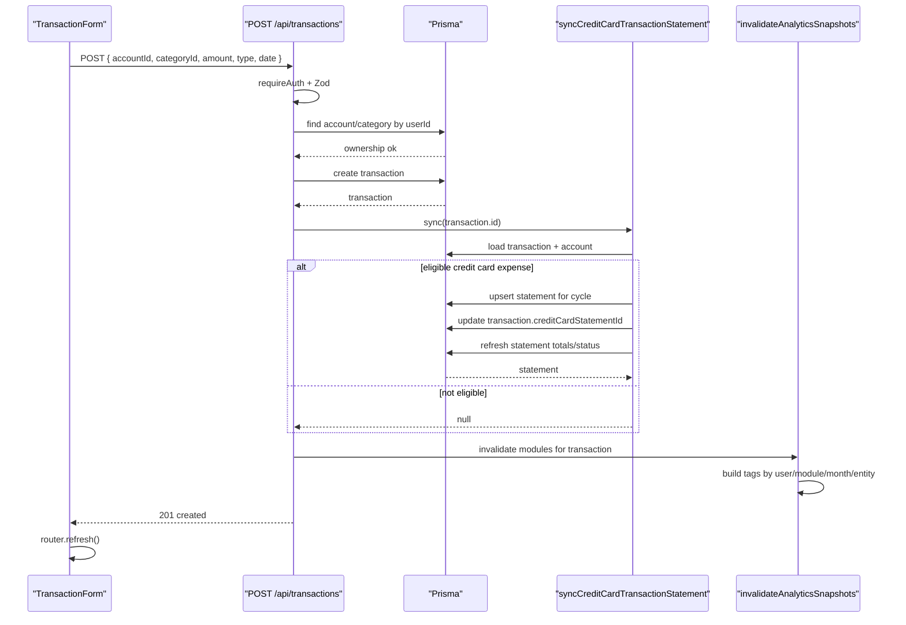
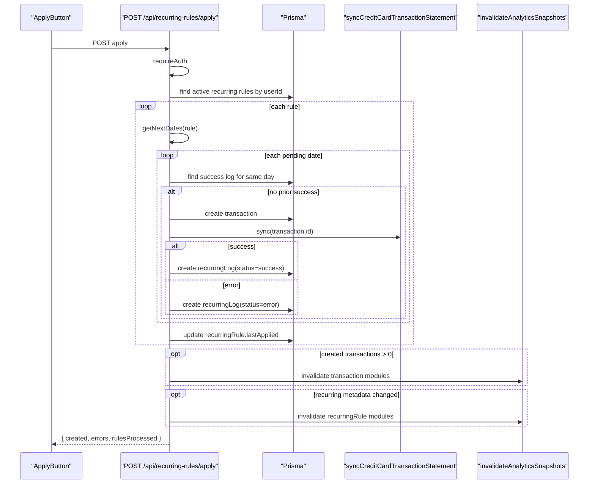
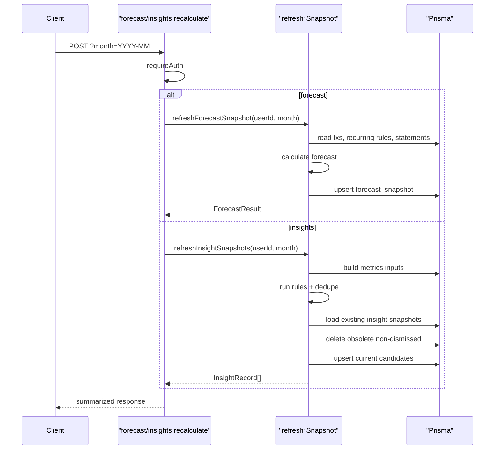
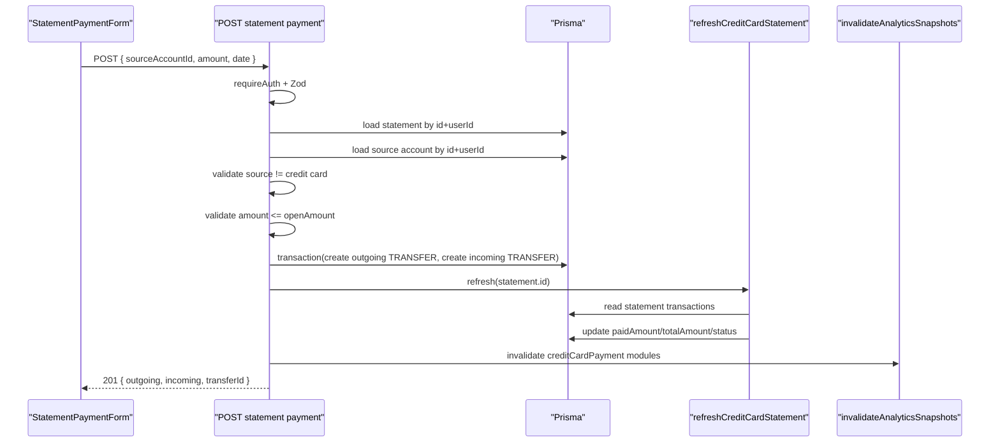

# [Architecture Topic]

## Status

- [ ] Draft
- [ ] In Review
- [x] Approved

## Purpose

Documentar as sequencias mais sensiveis do sistema com foco em rastreabilidade operacional entre cliente, Route Handlers, camada `application`, Prisma, banco e invalidacao.

## Scope

Cobrir os cenarios de maior impacto operacional e arquitetural hoje:

- criacao de transacao com sync de fatura;
- aplicacao de recorrencias;
- recalculate de forecast/insights;
- pagamento de fatura de cartao.

## Sources of Truth

- Spec: `.docs/future-features/18-docs-architecture-sequence.md`
- Task: `.docs/tasks/phase-26-architecture-sequence.md`
- ADRs:
  - `.docs/decisions/ADR-004-transfer-strategy.md`
  - `.docs/decisions/ADR-006-recurring-rules.md`
  - `.docs/decisions/ADR-008-credit-card-billing-cycle.md`
  - `.docs/decisions/ADR-009-analytics-snapshot-invalidation.md`
  - `.docs/decisions/ADR-011-forecast-engine.md`
  - `.docs/decisions/ADR-012-financial-score.md`
  - `.docs/decisions/ADR-013-automatic-insights.md`
- Code:
  - `src/app/(app)/transactions/transaction-form.tsx`
  - `src/app/(app)/recurring/apply-button.tsx`
  - `src/app/(app)/credit-cards/[id]/statement-payment-form.tsx`
  - `src/app/api/transactions/route.ts`
  - `src/app/api/recurring-rules/apply/route.ts`
  - `src/app/api/analytics/forecast/recalculate/route.ts`
  - `src/app/api/analytics/insights/recalculate/route.ts`
  - `src/app/api/credit-cards/statements/[id]/payments/route.ts`
  - `src/server/modules/finance/application/credit-card/billing.ts`
  - `src/server/modules/finance/application/forecast/calculate-forecast.ts`
  - `src/server/modules/finance/application/insights/use-cases.ts`
  - `src/server/modules/finance/application/analytics/invalidation.ts`
- Related docs:
  - `.docs/architecture/flows.md`
  - `.docs/api/transactions.md`
  - `.docs/api/analytics.md`
  - `.docs/data/data-dictionary.md`

## Overview

Os diagramas abaixo nao tentam cobrir todos os endpoints. Eles focam nos pontos em que a manutencao costuma exigir contexto cruzado entre mais de uma camada.

- Mutacoes financeiras geralmente seguem o padrao `UI client -> route.ts -> Prisma -> application auxiliar -> invalidation`.
- Leituras analiticas variam entre cache em `summary`, calculo on-demand e persistencia explicita de snapshots.
- Parte importante do risco arquitetural atual vem do fato de algumas rotas ainda acumularem orchestration que poderia morar em use cases dedicados.

## Actors and Components

| Component | Responsibility | Layer | Notes |
| --------- | -------------- | ----- | ----- |
| `TransactionForm` | Dispara criacao de receita/despesa | UI client | Converte valor para centavos |
| `ApplyButton` | Dispara apply manual de recorrencias | UI client | Aciona processamento em lote |
| `StatementPaymentForm` | Dispara pagamento de fatura | UI client | Usa rota dedicada de billing |
| `POST /api/transactions` | Cria transacao e invalida analytics | API | Chama sync de cartao |
| `POST /api/recurring-rules/apply` | Processa regras ativas | API | Ainda concentra loop e regras operacionais |
| `POST /api/analytics/forecast/recalculate` | Persiste snapshot de forecast | API | Reusa use case |
| `POST /api/analytics/insights/recalculate` | Persiste feed do periodo | API | Reusa pipeline completo |
| `POST /api/credit-cards/statements/[id]/payments` | Registra pagamento de fatura | API | Modela pagamento como transferencia |
| `billing.ts` | Upsert/refresh de fatura e vinculo transacao-fatura | Application | Reutilizado por varias mutacoes |
| `calculate-forecast.ts` | Calcula e persiste forecast | Application | Snapshot por `userId + periodStart` |
| `insights/use-cases.ts` | Executa regras, dedupe e upsert/delete de snapshots | Application | Preserva dismiss |
| `invalidation.ts` | Gera tags e chama `revalidateTag` | Application | Centro de consistencia eventual |
| `Prisma` | Leitura/escrita no banco | Infra | Ainda acessado direto por handlers |

## Entry Points

- `POST /api/transactions`
- `POST /api/recurring-rules/apply`
- `POST /api/analytics/forecast/recalculate`
- `POST /api/analytics/insights/recalculate`
- `POST /api/credit-cards/statements/[id]/payments`

## Main Flow

1. O cliente envia um comando HTTP a partir da UI.
2. A rota autentica e valida o payload.
3. A rota escreve no banco ou delega para um use case que compoe leituras/escritas.
4. Se o fluxo alterar fatos financeiros, billing e invalidacao sao executados como efeitos colaterais.
5. O cliente recebe a resposta e normalmente chama `router.refresh()`.

## Sequence 1: Criacao De Transacao Com Sync De Fatura

### Overview

Este e o melhor exemplo de mutacao operacional simples que acaba encadeando integracao com billing e invalidacao ampla.

### Main Flow

1. `TransactionForm` envia `POST /api/transactions`.
2. O handler autentica e valida.
3. Conta e categoria sao verificadas por `userId`.
4. A transacao e criada.
5. `syncCreditCardTransactionStatement()` decide se deve vincular a compra a uma fatura.
6. Se a conta for cartao e a transacao for `EXPENSE`, a fatura e atualizada.
7. Analytics e invalido por tags.
8. O cliente atualiza a UI.

### Sequence Diagram

### Failure Modes and Recovery

| Failure | Detection | Recovery |
| ------- | --------- | -------- |
| Conta ou categoria nao pertencem ao usuario | `400` no handler | Corrigir selecao |
| JSON invalido ou excecao inesperada | `500` | Retry manual |
| Sync de cartao nao se aplica | `statement = null` | Fluxo segue sem billing |

### Caching and Consistency

- Cache or snapshot behavior: a resposta devolve a transacao original; o `creditCardStatementId` final pode nao aparecer no payload retornado.
- Invalidation strategy: invalida `summary`, `goals`, `forecast`, `score`, `insights` e `credit-card`.
- Consistency boundaries: create da transacao e refresh de billing nao estao em uma unica transacao global.

### Security and Multi-tenant Notes

- Ownership e checado em conta/categoria antes do create.
- `userId` da transacao sempre vem da sessao.

## Sequence 2: Aplicacao De Recorrencias Em Lote

### Overview

Este e o fluxo com mais branching operacional no backlog atual. Ele mistura agenda calculada, idempotencia, criacao de transacoes, billing e invalidação.

### Main Flow

1. `ApplyButton` chama `POST /api/recurring-rules/apply`.
2. O handler carrega regras ativas do usuario.
3. Para cada regra calcula datas pendentes.
4. Para cada data:
   - consulta `RecurringLog` de sucesso naquele dia;
   - se nao existir, cria transacao;
   - tenta sincronizar cartao;
   - registra `RecurringLog` de sucesso ou erro.
5. Atualiza `lastApplied` no fim da regra.
6. Invalida analytics de transacao e de recorrencia quando aplicavel.

### Sequence Diagram

### Failure Modes and Recovery

| Failure | Detection | Recovery |
| ------- | --------- | -------- |
| Data ja aplicada | `RecurringLog` `success` encontrado | Dia e pulado |
| Erro criando transacao | Catch local | Log `error` e continua processamento |
| Backlog excessivo | Hard cap 365 datas por regra | Evita loop longo/infinito |

### Caching and Consistency

- Cache or snapshot behavior: nao cria snapshots diretamente.
- Invalidation strategy: invalida por `transaction` e/ou `recurringRule`.
- Consistency boundaries: cada data e tratada isoladamente; o apply inteiro nao e atomico.

### Security and Multi-tenant Notes

- Regras sao filtradas por `userId`.
- Logs dependem de ownership transitivo via `RecurringRule`.

## Sequence 3: Recalculate De Forecast E Insights

### Overview

Essas duas sequencias representam o lado “modular” mais maduro da arquitetura: a rota e curta e o peso fica nos use cases.

### Main Flow

1. O cliente chama `POST /api/analytics/forecast/recalculate` ou `POST /api/analytics/insights/recalculate`.
2. A rota autentica e resolve `month`.
3. A rota delega para um use case:
   - `refreshForecastSnapshot`;
   - `refreshInsightSnapshots`.
4. O use case calcula o resultado do periodo.
5. O snapshot e persistido por `upsert`, com limpeza/atualizacao especifica por modulo.
6. A rota devolve um DTO resumido.

### Sequence Diagram

### Failure Modes and Recovery

| Failure | Detection | Recovery |
| ------- | --------- | -------- |
| Erro ao ler insumos analíticos | Excecao no use case | `500` |
| Conjunto persistido diverge do feed em memoria | Dedupe/delete/upsert em insights | Novo recalculate reconcilia |
| Snapshot antigo | `staleAt` ou ausência de refresh | Executar recalculate novamente |

### Caching and Consistency

- Cache or snapshot behavior:
  - forecast grava um snapshot por `userId + periodStart`;
  - insights reconcilia um conjunto por `userId + periodStart + fingerprint`.
- Invalidation strategy: estes endpoints em si nao invalidam tags; eles atualizam a persistencia derivada.
- Consistency boundaries: a camada analítica opera com consistencia eventual; a fonte operacional continua sendo tabelas de fatos.

### Security and Multi-tenant Notes

- Os use cases recebem `userId` da sessao.
- Toda leitura/escrita e escopada ao usuario.

## Sequence 4: Pagamento De Fatura Como Transferencia Especial

### Overview

Este fluxo combina validacao de regra de negocio, dupla escrita atomica e refresh de billing.

### Main Flow

1. `StatementPaymentForm` envia o pagamento.
2. O handler valida sessao, payload, ownership da fatura e conta de origem.
3. Verifica:
   - conta de origem diferente do cartao;
   - fatura nao quitada;
   - valor nao excede o saldo em aberto.
4. Cria duas transacoes `TRANSFER` dentro de `prisma.$transaction`.
5. Chama `refreshCreditCardStatement(statement.id)`.
6. Invalida analytics dos modulos de `creditCardPayment`.
7. Devolve a resposta para a UI.

### Sequence Diagram

### Failure Modes and Recovery

| Failure | Detection | Recovery |
| ------- | --------- | -------- |
| Fatura nao pertence ao usuario | `404` | Recarregar contexto |
| Conta de origem invalida | `400` | Corrigir formulario |
| Pagamento acima do aberto ou fatura quitada | `400` | Ajustar valor / abortar |

### Caching and Consistency

- Cache or snapshot behavior: nenhuma leitura posterior depende do payload; a UI costuma recarregar o estado.
- Invalidation strategy: invalida `summary`, `forecast`, `score`, `insights` e `credit-card`.
- Consistency boundaries: as duas linhas `TRANSFER` sao atomicas; o refresh da fatura ocorre logo depois, fora da mesma transacao maior.

### Security and Multi-tenant Notes

- Fatura e conta fonte sao verificadas por `userId`.
- A linha de entrada no cartao leva `creditCardStatementId`, conectando pagamento e fatura.

## Failure Modes and Recovery

| Failure | Detection | Recovery |
| ------- | --------- | -------- |
| Rota com regra demais | `route.ts` extensa e com varios side effects | Extrair use case dedicado |
| Resultado derivado desatualizado | Snapshot/cache sem refresh recente | Recalculate ou proxima leitura apos invalidacao |
| Divergencia UI server vs API | Mesma informacao lida por caminhos diferentes | Reforcar modulos compartilhados e DTOs comuns |

## Caching and Consistency

- Cache or snapshot behavior:
  - `summary` usa cache por tags;
  - forecast, score, goals e insights usam combinacao de calculo on-demand e snapshot persistido.
- Invalidation strategy:
  - centralizada em `application/analytics/invalidation.ts`;
  - orientada por modulo, mes e entidade afetada.
- Consistency boundaries:
  - mutacoes escrevem fatos primeiro e atualizam derivados depois;
  - o sistema trabalha com consistencia eventual para analytics.

## Security and Multi-tenant Notes

- `requireAuth()` protege as superfícies HTTP mutadoras e analíticas.
- `userId` e a principal fronteira de tenant.
- Entidades sem `userId` direto dependem de ownership transitivo no código.

## Observability

- Logs: nao ha logging estruturado por fluxo.
- Metrics: nao ha metricas operacionais dedicadas por endpoint/modulo.
- Manual validation:
  - revisar se os diagramas refletem os handlers citados;
  - revisar side effects em `billing.ts`, `calculate-forecast.ts`, `insights/use-cases.ts` e `invalidation.ts`;
  - conferir que cada sequencia representa o caminho real implementado hoje.

## Open Questions

- Vale criar use cases dedicados para transacao, transferencia, apply de recorrencia e pagamento de fatura.
- Vale padronizar melhor a divisao entre leitura on-demand e leitura de snapshot persistido.
- A dashboard deveria reduzir efeitos colaterais em render server-side, especialmente no fluxo de insights.
