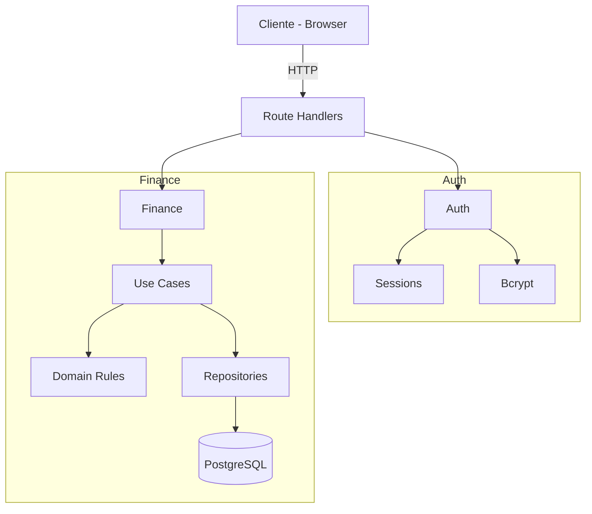
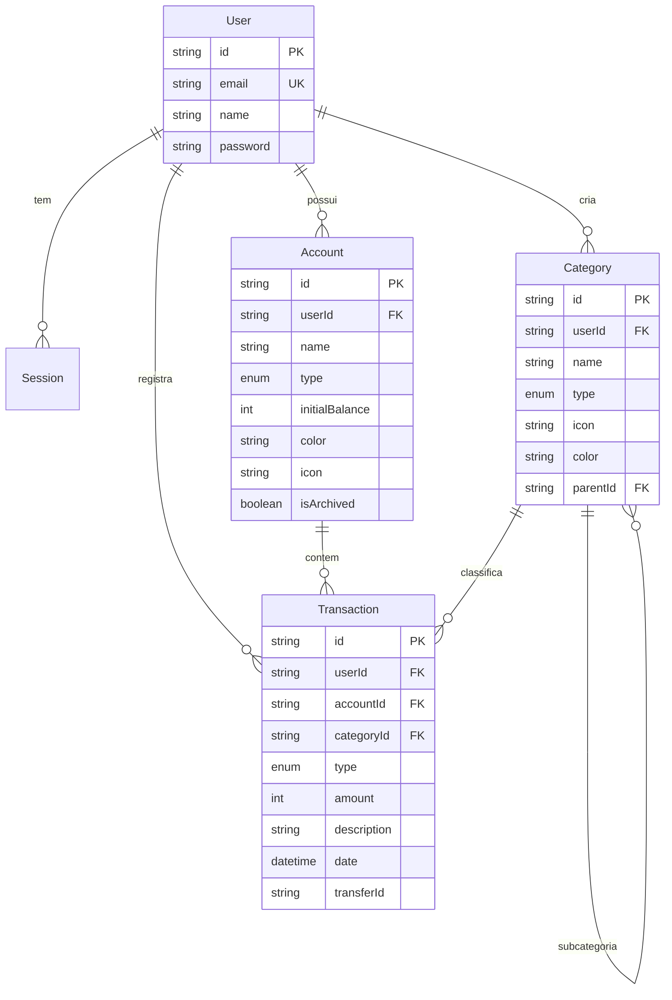

# Finance Controller

Sistema fullstack de gestao financeira pessoal, construido com foco em arquitetura limpa, performance e visualizacao de dados.

> Organize sua vida financeira com clareza, controle e autonomia.

<!--  -->

---

## Problema

Gerenciar financas pessoais geralmente envolve:

- Planilhas desorganizadas e propensas a erro
- Multiplas plataformas sem integracao
- Falta de visualizacao clara dos gastos
- Categorizacao rigida que nao reflete a realidade

## Solucao

O Finance Controller centraliza o controle financeiro em uma unica aplicacao:

- Receitas, despesas e transferencias entre contas
- Categorias customizaveis e hierarquicas (com icones e cores)
- Dashboard visual com graficos interativos
- Multi-contas (carteira, corrente, poupanca, cartao de credito, investimentos)
- Arquitetura multi-tenant pronta para escalar

---

## Funcionalidades

- Dashboard financeiro com saldo consolidado e variacao mensal
- Grafico de barras — receitas vs despesas por mes
- Grafico de rosca — gastos por categoria
- Controle de receitas, despesas e transferencias
- Categorias hierarquicas customizaveis
- Multi-contas com tipos distintos
- Autenticacao com sessoes server-side e cookies HttpOnly
- Rate limiting na autenticacao
- Filtros por periodo (mes/ano)
- Landing page com branding
- Dark mode

---

## Arquitetura

O projeto segue uma **arquitetura em camadas** com separacao clara de responsabilidades:

```
UI (Next.js App Router)
  |
API (Route Handlers) — validacao Zod, auth guard, chamada ao use case
  |
Application (Use Cases) — orquestracao de regras de negocio
  |
Domain — entidades, regras, value objects
  |
Infrastructure — repositorios Prisma, servicos externos
```



### Principios

- **Route Handlers sao adaptadores**: validam input (Zod), checam sessao, chamam use case, retornam Response
- **Logica de negocio nos use cases e domain**, nunca nos route handlers
- **Repository pattern** para acesso ao banco
- **Multi-tenant por padrao**: toda tabela financeira tem `userId`, toda query filtra por `userId`
- **Valores monetarios em centavos**: inteiros para evitar erros de ponto flutuante (R$ 150,75 = `15075`)

---

## Estrutura de Pastas

```
finance-controller/
|
├── src/
│   ├── app/
│   │   ├── (public)/              # Landing page
│   │   ├── (auth)/                # Login, registro
│   │   ├── (app)/                 # Paginas autenticadas
│   │   │   ├── dashboard/
│   │   │   ├── transactions/
│   │   │   ├── accounts/
│   │   │   ├── categories/
│   │   │   └── settings/
│   │   └── api/                   # Route Handlers
│   │       ├── auth/              # login, register, logout, me
│   │       ├── accounts/          # CRUD + [id]
│   │       ├── categories/        # CRUD + [id]
│   │       ├── transactions/      # CRUD + [id] + transfer
│   │       └── analytics/         # summary
│   │
│   ├── server/
│   │   ├── auth/                  # Sessoes, hashing, guards
│   │   └── modules/finance/
│   │       ├── domain/            # Entidades, regras
│   │       ├── application/       # Use cases
│   │       ├── infra/             # Repositorios Prisma
│   │       └── http/              # DTOs, validators Zod
│   │
│   ├── components/
│   │   ├── ui/                    # shadcn/ui
│   │   └── layout/                # Sidebar, topbar, shells
│   │
│   ├── hooks/                     # React hooks
│   ├── lib/                       # Utilitarios compartilhados
│   └── types/                     # Tipos TypeScript
│
├── prisma/                        # Schema + migrations
└── .docs/                         # Documentacao, ADRs, tasks
```

---

## Stack e Decisoes Tecnicas

| Camada     | Tecnologia                        |
| ---------- | --------------------------------- |
| Framework  | Next.js 16 (App Router)           |
| Linguagem  | TypeScript                        |
| Styling    | Tailwind CSS v4 + shadcn/ui       |
| Banco      | PostgreSQL                        |
| ORM        | Prisma 7                          |
| Validacao  | Zod                               |
| Auth       | Custom (sessoes server-side)      |
| Graficos   | Recharts                          |

### Por que essas escolhas?

**Next.js 16 (App Router)** — Server Components para performance, layouts aninhados para UX, e deploy simplificado na Vercel.

**PostgreSQL + Prisma 7** — Consistencia relacional essencial para dados financeiros. Prisma oferece type-safety no acesso ao banco e migrations versionadas.

**Tailwind CSS v4 + shadcn/ui** — Design system consistente com componentes acessiveis (Radix). Estilizacao utility-first para velocidade de desenvolvimento.

**Zod** — Validacao de schemas tanto no frontend (forms) quanto no backend (API inputs) com inferencia de tipos.

**Valores em centavos (inteiros)** — Evita problemas classicos de floating-point em operacoes financeiras. R$ 150,75 e armazenado como `15075`.

**Sessoes server-side** — Controle total sobre sessoes, sem dependencia de provedores terceiros. Cookies HttpOnly para seguranca.

---

## Banco de Dados



**Tipos de conta**: Carteira, Corrente, Poupanca, Cartao de Credito, Investimento, Outro

**Tipos de transacao**: Receita, Despesa, Transferencia

**Transferencias**: Modeladas como par de transacoes vinculadas por `transferId` — debito na origem, credito no destino.

---

## Fluxos Principais

### Criacao de Transacao

```
1. Usuario preenche formulario (valor, categoria, conta, data)
2. Frontend envia POST /api/transactions
3. Route Handler valida input com Zod + verifica sessao
4. Use Case aplica regras de negocio
5. Repository persiste no PostgreSQL
6. Resposta retorna transacao criada
```

### Transferencia entre Contas

```
1. Usuario seleciona conta origem, destino e valor
2. POST /api/transactions/transfer
3. Use Case cria par de transacoes (EXPENSE na origem + INCOME no destino)
4. Ambas vinculadas pelo mesmo transferId
5. Saldos atualizados automaticamente
```

### Dashboard

```
1. GET /api/analytics/summary?month=2026-04
2. Backend calcula: saldo total, receitas, despesas, variacao mensal
3. Agrupa gastos por categoria e saldo por conta
4. Frontend renderiza hero card, stat cards, graficos e lista
```

---

## Como Rodar

### Pre-requisitos

- Node.js 18+
- PostgreSQL rodando localmente
- npm

### Setup

```bash
# Clonar o repositorio
git clone git@github.com:Senavictors/finance-controller.git
cd finance-controller

# Instalar dependencias
npm install

# Configurar variaveis de ambiente
cp .env.example .env
# Editar .env com sua DATABASE_URL

# Rodar migrations
npx prisma migrate dev

# Gerar o client Prisma
npx prisma generate

# Iniciar o servidor de desenvolvimento
npm run dev
```

Acesse [http://localhost:3000](http://localhost:3000)

### Comandos Uteis

```bash
npm run dev            # Dev server
npm run build          # Build de producao
npm run lint           # ESLint
npm run format         # Prettier (formatar)
npx prisma studio      # GUI do banco de dados
```

---

## API Routes

| Metodo   | Rota                          | Descricao                   |
| -------- | ----------------------------- | --------------------------- |
| POST     | `/api/auth/register`          | Criar conta                 |
| POST     | `/api/auth/login`             | Login                       |
| POST     | `/api/auth/logout`            | Logout                      |
| GET      | `/api/auth/me`                | Usuario autenticado         |
| GET/POST | `/api/accounts`               | Listar / criar conta        |
| GET/PUT/DELETE | `/api/accounts/[id]`     | Detalhe / editar / deletar  |
| GET/POST | `/api/categories`             | Listar / criar categoria    |
| GET/PUT/DELETE | `/api/categories/[id]`   | Detalhe / editar / deletar  |
| GET/POST | `/api/transactions`           | Listar / criar transacao    |
| GET/PUT/DELETE | `/api/transactions/[id]` | Detalhe / editar / deletar  |
| POST     | `/api/transactions/transfer`  | Transferencia entre contas  |
| GET      | `/api/analytics/summary`      | Resumo financeiro mensal    |

---

## Roadmap

- [x] Fundacao do projeto (Next.js, Prisma, Tailwind, shadcn/ui)
- [x] Sistema de autenticacao (sessoes server-side, bcrypt, rate limiting)
- [x] Nucleo financeiro (contas, categorias, transacoes, transferencias)
- [x] Dashboard MVP (hero card, stat cards, graficos, ultimas transacoes)
- [x] Redesign visual (tema Apex Holdings, tipografia refinada)
- [ ] Dashboard customizavel (drag & drop widgets)
- [ ] Transacoes recorrentes
- [ ] Import/export CSV
- [ ] Metas financeiras
- [ ] PWA / responsivo mobile

---

## Autor

**Victor Ribeiro**
Desenvolvedor Fullstack

[](https://github.com/Senavictors)
