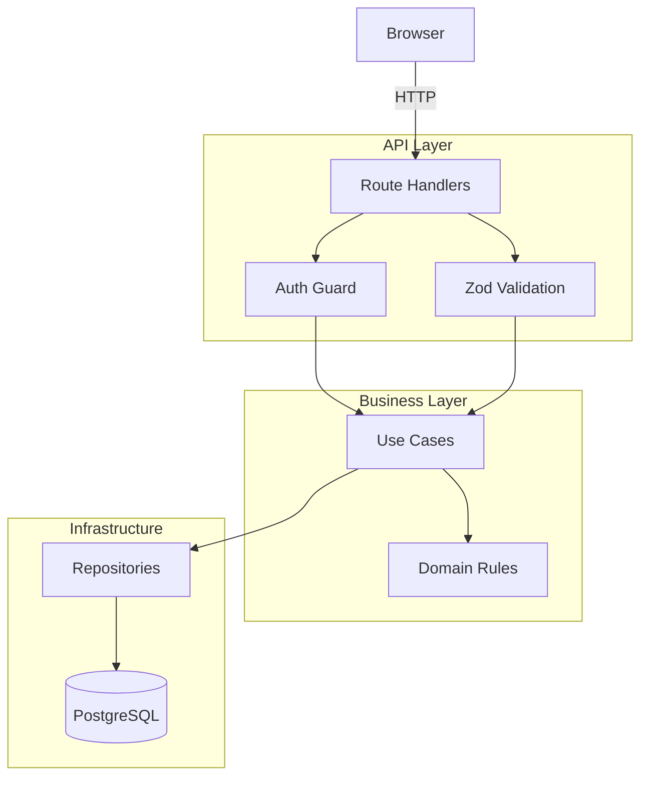
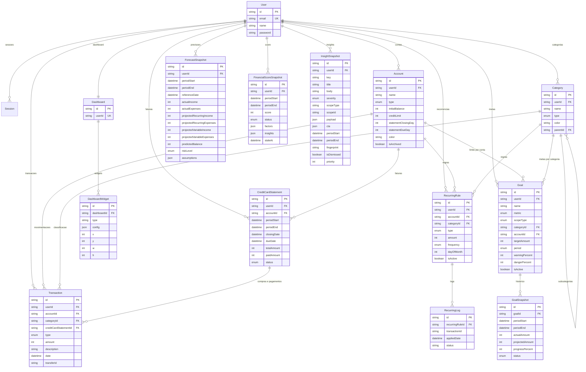

# Finance Controller


Sistema fullstack de gestao financeira pessoal, focado em controle, visualizacao e tomada de decisao.

> Organize sua vida financeira com clareza, performance e autonomia.

**Demo**: `demo@finance.com` / `demo1234` — execute `npx prisma db seed` para popular o banco.

---

## Preview

<p align="center">
  
</p>

<p align="center">
  
</p>

<p align="center">
  
  
</p>

<p align="center">
  
  
</p>

<p align="center">
  
  
</p>

---

## Problema

Gerenciar financas pessoais geralmente envolve:

- Planilhas manuais propensas a erro e sem estrutura
- Multiplas plataformas que nao conversam entre si
- Falta de visualizacao clara dos gastos e tendencias
- Categorizacao rigida que nao reflete a vida real

## Solucao

O Finance Controller centraliza tudo em uma unica aplicacao:

- Receitas, despesas e transferencias entre contas
- Categorias customizaveis e hierarquicas
- Identidade visual por marca para bancos, bandeiras, pagamentos e assinaturas
- Dashboard visual e customizavel com drag-and-drop
- Recorrencias configuraveis com apply manual idempotente (salario, aluguel, assinaturas)
- Multi-contas com tipos distintos (corrente, cartao, investimento)

---

## Funcionalidades

- **Dashboard customizavel** — drag-and-drop de widgets com react-grid-layout, 10 tipos registrados, 5 widgets default e layout persistido por usuario
- **Multi-contas** — corrente, carteira, poupanca, cartao de credito, investimento
- **Categorias hierarquicas** — receitas e despesas com subcategorias, cores e contagem de transacoes
- **Brand registry visual** — `src/lib/brands/` centraliza bancos, bandeiras, pagamentos e assinaturas; `BrandIcon`, `BrandDot` e `BrandPicker` padronizam contas, categorias, transacoes, recorrencias, metas, faturas e widgets
- **Logos reais com fallback seguro** — 33 assets reais em `public/brands/` substituem os SVGs artesanais na maior parte das marcas; `Neon` e `Pix` permanecem com fallback vetorial explicito
- **Transacoes** — CRUD completo com filtros por tipo, categoria e busca por descricao
- **Transferencias atomicas** — par de transacoes vinculadas por `transferId` (debito na origem, credito no destino)
- **Recorrencias** — regras com frequencia (diaria, semanal, mensal, anual), apply manual idempotente com logs
- **Billing de cartao de credito** — limite, fechamento, vencimento, faturas e pagamento parcial/total
- **Goal Engine** — metas de economia, limite de gasto, meta de receita e limite por conta/cartao, com calculo de progresso por periodo, status (no ritmo, atencao, em risco, atingida, ultrapassada) e snapshots historicos
- **Forecast Engine** — previsao do fechamento do mes combinando realizado, recorrencias futuras, projecao variavel (media movel) e faturas em aberto, com classificacao de risco e breakdown audit das premissas
- **Financial Score** — pontuacao 0-100 com 5 fatores explicaveis (economia, estabilidade, renda, cartao, metas), status CRITICAL/ATTENTION/GOOD/EXCELLENT, delta vs mes anterior e redistribuicao por ausencia de dados
- **Automatic Insights** — motor deterministico com 6 heuristicas de alta confianca (variacao por categoria, concentracao, metas em risco, forecast negativo, fatura vencendo/vencida, utilizacao alta de cartao), dedupe por fingerprint, cap de 8 por periodo e dismiss persistente
- **Autenticacao segura** — bcrypt, sessoes server-side, cookies HttpOnly, rate limiting
- **Analytics** — resumo mensal com variacao percentual, gastos por categoria, saldo por conta, patrimonio total
- **Snapshot e invalidacao** — estrategia central de tags por usuario/modulo/mes, invalidada em mutacoes financeiras
- **Tema refinado** — design inspirado em Apex Holdings (Inter font, cantos arredondados, sombras suaves, gradientes sutis)
- **Seed demo** — dados ficticios realistas + botao de reset em `/settings`, com fatura paga, outra em aberto e 3 metas demo

---

## Arquitetura

O projeto segue como direcao uma **arquitetura em camadas** com separacao clara de responsabilidades:



> Estado atual: analytics, billing de cartao, metas, forecast, score e insights ja usam `src/server/modules/finance/application/`, mas parte dos CRUDs e algumas Server Components ainda acessam Prisma diretamente.

### Principios

- **Route Handlers devem atuar como adaptadores** — validam input (Zod), verificam sessao, orquestram a operacao e retornam Response
- **Extracao gradual da logica de negocio** — analytics, billing, metas, forecast, score e insights ja vivem em `application`, enquanto alguns CRUDs ainda mantem Prisma direto em `route.ts` e Server Components
- **Repository pattern** — `TransactionRepository`, `CategoryRepository`, etc.
- **Multi-tenant por padrao** — toda tabela financeira tem `userId`, toda query filtra por `userId`
- **Valores em centavos** — inteiros para evitar floating-point (R$ 150,75 = `15075`)

---

## Estrutura de Pastas

```
src/
  app/
    (public)/              Landing page
    (auth)/                Login, Register
    (app)/                 Paginas autenticadas
      dashboard/           Dashboard customizavel
      transactions/        Listagem e CRUD
      categories/          Receitas e despesas
      accounts/            Multi-contas
      credit-cards/        Faturas e pagamento de cartao
      recurring/           Regras recorrentes
      goals/               Metas financeiras e progresso
      settings/            Configuracoes + reset demo
    api/                   31 Route Handlers
      auth/                login, register, logout, me
      accounts/            CRUD + [id]
      categories/          CRUD + [id]
      transactions/        CRUD + [id] + transfer
      analytics/           summary + forecast + score + score/history + insights + insights/recalculate + insights/[id]/dismiss
      credit-cards/        statements, detail, payments
      dashboards/          GET/PUT layout + POST/DELETE widgets
      recurring-rules/     CRUD + apply
      goals/               CRUD + [id] de metas
      settings/            reset-demo
  server/
    auth/                  Sessions, hashing, guards, rate-limit
    modules/finance/
      domain/              Entidades e regras de negocio
      application/         analytics + credit-card billing + goals + forecast + score + insights
      infra/               Repositorios Prisma
      http/                DTOs e validators Zod
  components/
    ui/                    shadcn/ui (Base UI)
    layout/                Sidebar, Topbar, AppShell
  lib/
    brands/                Registry de marcas + BrandIcon/BrandDot/BrandPicker
    utils.ts               Utilitarios (formatCurrency, cn)
  hooks/                   Custom hooks (usePeriod)
  types/                   Tipos TypeScript compartilhados
prisma/                    Schema + migrations + seed
public/                    Assets estaticos versionados
  brands/                  Logos reais para bancos, bandeiras, pagamentos e assinaturas
.docs/                     Documentacao viva (context, ADRs, tasks, domain/api/data/architecture)
```

---

## Documentacao

Toda evolucao documental do projeto vive em `.docs/`, mas o `README.md` tambem faz parte obrigatoria do ritual documental porque concentra o roadmap publico, o proximo passo e as phases concluidas.

Fluxo obrigatorio ao criar uma nova task:

```text
future-features -> tasks -> CONTEXT -> README (roadmap, backlog aberto, proximo passo)
```

Fluxo obrigatorio ao concluir uma task/phase:

```text
execucao -> CONTEXT -> README (roadmap, phases concluidas, proximo passo) -> CHANGELOG
```

Camadas principais:

- `README.md` — roadmap publico do projeto, backlog aberto, phases concluidas e proximo passo recomendado
- `.docs/CONTEXT.md` — estado vivo do projeto
- `.docs/vision.md` — visao de produto
- `.docs/architecture/README.md` — overview arquitetural
- `.docs/domain/` — regras de negocio e dominio
- `.docs/api/` — contratos HTTP
- `.docs/data/` — semantica de dados e dicionario
- `.docs/architecture/` — deep dives de fluxos e sequencias
- `.docs/decisions/` — ADRs
- `.docs/tasks/` — execucao faseada
- `.docs/CHANGELOG.md` — historico curado

Regra operacional:

- novas docs dessas camadas devem nascer sempre a partir de `future-features/`, virar `task` e usar o `_TEMPLATE.md` correspondente;
- ao criar uma task nova, atualizar tambem o `README.md` na secao de roadmap/backlog;
- ao concluir uma task ou phase, atualizar tambem o `README.md` nas secoes de roadmap, phases concluidas e proximo passo, alem do `CHANGELOG` quando fizer sentido.

---

## Stack e Decisoes Tecnicas

| Camada         | Tecnologia                             |
| -------------- | -------------------------------------- |
| Framework      | Next.js 16 (App Router)                |
| Linguagem      | TypeScript                             |
| Estilizacao    | Tailwind CSS v4 + shadcn/ui            |
| Banco de Dados | PostgreSQL                             |
| ORM            | Prisma 7                               |
| Validacao      | Zod                                    |
| Graficos       | Recharts                               |
| Dashboard      | react-grid-layout                      |
| Auth           | Custom (bcrypt + server-side sessions) |
| CI             | GitHub Actions                         |

### Por que essas escolhas?

**Next.js 16 (App Router)** — Server Components para performance, layouts aninhados para UX complexa, e route handlers como camada HTTP fina. Deploy simplificado na Vercel.

**PostgreSQL + Prisma 7** — Consistencia relacional e essencial para dados financeiros. Prisma oferece type-safety, migrations versionadas e gerador de client com inferencia completa.

**Tailwind CSS v4 + shadcn/ui** — Design system consistente com componentes acessiveis (Radix). Utility-first para velocidade sem sacrificar qualidade visual.

**Zod** — Schema validation unificada: mesmos schemas validam forms no frontend e inputs na API, com inferencia automatica de tipos TypeScript.

**Valores em centavos (inteiros)** — Evita problemas classicos de floating-point em calculos financeiros. R$ 150,75 armazenado como `15075`.

**Sessoes server-side** — Controle total sobre sessoes sem depender de provedores. Cookies HttpOnly + rate limiting para seguranca.

**react-grid-layout** — Dashboard customizavel com drag-and-drop e resize. Layout persistido no banco por usuario.

---

## Fluxos Principais

### Criacao de Transacao

```
1. Usuario preenche formulario (valor, categoria, conta, data)
2. Frontend envia POST /api/transactions
3. Route Handler valida input com Zod + verifica sessao
4. Handler aplica ownership checks e regras basicas do fluxo
5. Prisma persiste a transacao no PostgreSQL
6. Snapshots analiticos relacionados sao invalidados
```

### Transferencia entre Contas

```
1. Usuario seleciona conta origem, destino e valor
2. POST /api/transactions/transfer
3. Route Handler valida as contas e cria o par dentro de `prisma.$transaction`
4. Ambas vinculadas pelo mesmo transferId
5. Snapshots analiticos e saldos derivados refletem a mudanca
```

### Recorrencias

```
1. Usuario cria regra (Netflix mensal, salario, aluguel)
2. Clica manualmente em "Aplicar"
3. Handler calcula regras pendentes ate a data atual
4. Cria transacoes com controle de idempotencia (RecurringLog)
5. Nenhuma transacao duplicada mesmo se aplicar multiplas vezes
```

### Dashboard

```
1. Dashboard server-side carrega o mes selecionado
2. Summary vem da camada `application`, enquanto parte das leituras ainda combina use cases e Prisma direto
3. Frontend renderiza widgets no grid customizavel
4. Usuario reorganiza widgets com drag-and-drop
5. Layout e salvo via `PUT /api/dashboards`
```

---

## Banco de Dados

15 models, 12 enums (incluindo `GoalMetric`, `GoalScopeType`, `GoalPeriod`, `GoalStatus`, `ForecastRiskLevel`, `FinancialScoreStatus`, `InsightSeverity`):



**Tipos de conta**: Carteira, Corrente, Poupanca, Cartao de Credito, Investimento, Outro

**Tipos de transacao**: Receita, Despesa, Transferencia

**Frequencias**: Diaria, Semanal, Mensal, Anual

**Status de fatura**: Aberta, Fechada, Paga, Atrasada

**Metricas de meta**: Economia (SAVING), Limite de gasto (EXPENSE_LIMIT), Meta de receita (INCOME_TARGET), Limite por conta (ACCOUNT_LIMIT)

**Status de meta**: No ritmo, Atencao, Em risco, Atingida, Ultrapassada

**Nivel de risco de previsao**: Low (folga), Medium (saldo apertado), High (saldo negativo)

**Status do Financial Score**: Critico (<40), Em atencao (40-59), Bom (60-79), Excelente (>=80)

**Severidade de insights**: INFO, WARNING, CRITICAL

---

## Como Rodar

### Pre-requisitos

- Node.js 20.9+
- PostgreSQL
- npm

### Setup

```bash
# Clonar
git clone git@github.com:Senavictors/Finance-Controller.git
cd Finance-Controller

# Instalar dependencias
npm install

# Configurar ambiente
cp .env.example .env
# Editar .env com sua DATABASE_URL do PostgreSQL

# Criar tabelas
npx prisma migrate dev

# Popular com dados demo
npx prisma db seed

# Gerar client Prisma
npx prisma generate

# Rodar em desenvolvimento
npm run dev
```

Acesse `http://localhost:3000`

### Comandos

```bash
npm run dev          # Dev server
npm run build        # Build producao
npm run lint         # ESLint
npm test             # Vitest
npm run format       # Prettier (write)
npm run format:check # Prettier (check)
npx prisma studio    # GUI do banco
npx prisma db seed   # Popular dados demo
```

---

## Roadmap

Estado atual: entregas concluidas ate a **Phase 32**, com validacao manual em light/dark/mobile como proxima trilha recomendada.

### Phases concluidas

- [x] Phase 1: Fundacao (Next.js, Tailwind, Prisma, ESLint)
- [x] Phase 2: Autenticacao (bcrypt, sessions, guards)
- [x] Phase 3: Nucleo Financeiro (contas, categorias, transacoes, transferencias)
- [x] Phase 4: Dashboard MVP (graficos, analytics, redesign visual)
- [x] Phase 5: Dashboard Customizavel (react-grid-layout, widgets)
- [x] Phase 6: Recorrencias (regras, apply idempotente, logs)
- [x] Phase 7: Portfolio (seed demo, CI, README)
- [x] Phase 8: Fundacao analitica + billing de cartao
- [x] Phase 8.5: Demo and Portfolio Hardening
- [x] Phase 9: Goal Engine
- [x] Phase 10: Forecast Engine
- [x] Phase 11: Financial Score
- [x] Phase 12: Automatic Insights
- [x] Phase 13: Documentation Foundation
- [x] Phase 14: Domain Docs - Goals
- [x] Phase 15: Domain Docs - Forecast
- [x] Phase 16: Domain Docs - Financial Score
- [x] Phase 17: Domain Docs - Insights
- [x] Phase 18: Logic Docs - Forecast Calculation
- [x] Phase 19: Logic Docs - Financial Score Calculation
- [x] Phase 20: Logic Docs - Insights Engine
- [x] Phase 21: API Docs - Transactions
- [x] Phase 22: API Docs - Analytics
- [x] Phase 23: API Docs - Goals
- [x] Phase 24: Data Docs - Data Dictionary
- [x] Phase 25: Architecture Docs - Flows
- [x] Phase 26: Architecture Docs - Sequence
- [x] Phase 27: SVG Brand Icons
- [x] Phase 28: Real Brand Logo Assets
- [x] Phase 29: Dashboard Layout And Widget Polish
- [x] Phase 30: Form Hardening And Status Feedback
- [x] Phase 31: Progressive Disclosure And List Scaling
- [x] Phase 32: Settings, Profile And Confirmation UX

### Phases abertas

- Nenhuma phase aberta no momento

### Proximo passo recomendado

- [ ] Rodada de validacao manual em light/dark/mobile cobrindo a nova area `/user` (foto, perfil, senha, exclusao de conta), o chip da topbar e os `ConfirmDialog`s migrados em contas, categorias, transacoes, recorrencias e metas
- [ ] Validar em ambiente seguro o fluxo de exclusao de conta (cascade de Prisma apaga contas, categorias, transacoes, metas, recorrencias, cartoes e dashboards)
- [ ] Manter em paralelo a validacao visual das superficies com `BrandIcon`/`BrandDot`, dos `MoneyInput`/`IntegerInput` e do padrao de `Carregar mais` aplicado em categorias, recorrencias e detalhe de fatura

### Backlog de produto

- [ ] Import/export CSV
- [ ] Relatorios e exportacao PDF
- [ ] PWA / responsivo mobile

---

## Autor

**Victor Sena** — Desenvolvedor Fullstack

[](https://github.com/Senavictors)

---

## Licenca

Projeto pessoal de portfolio.
