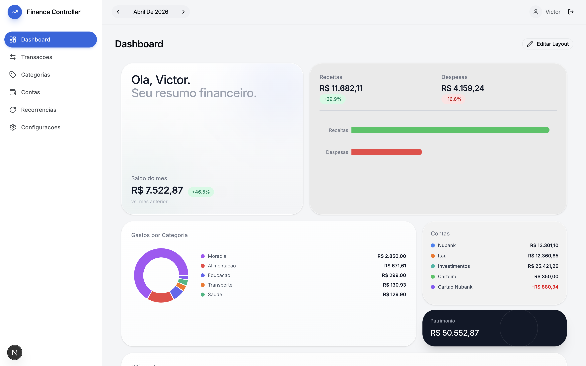
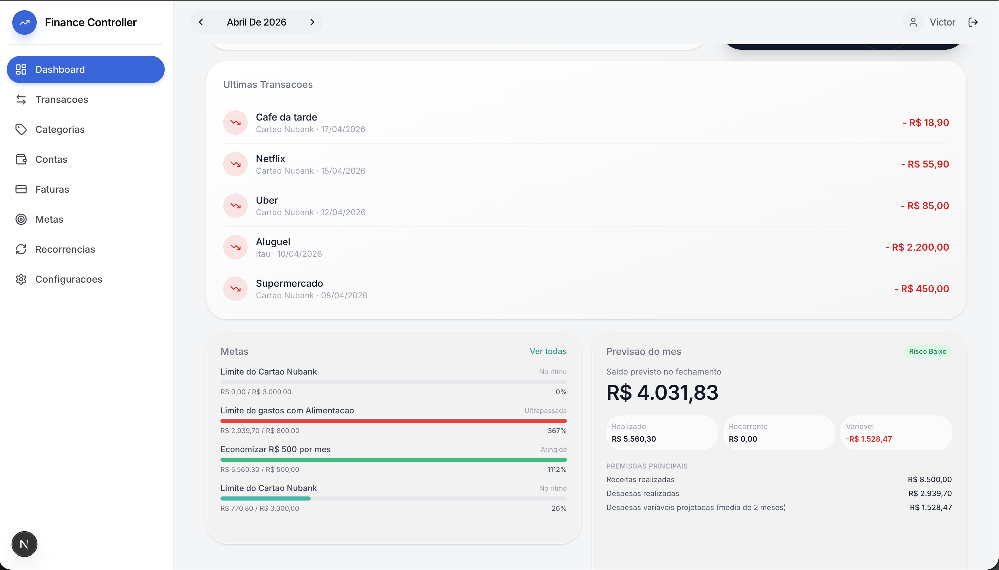
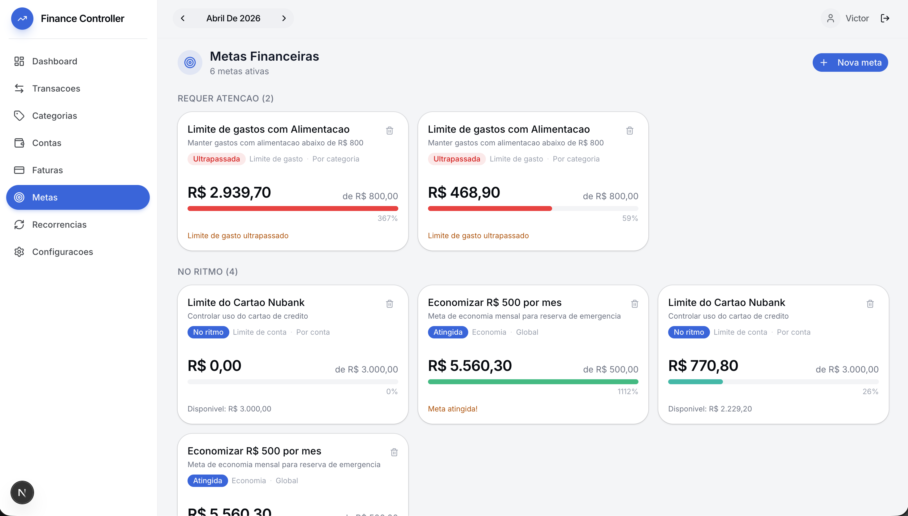
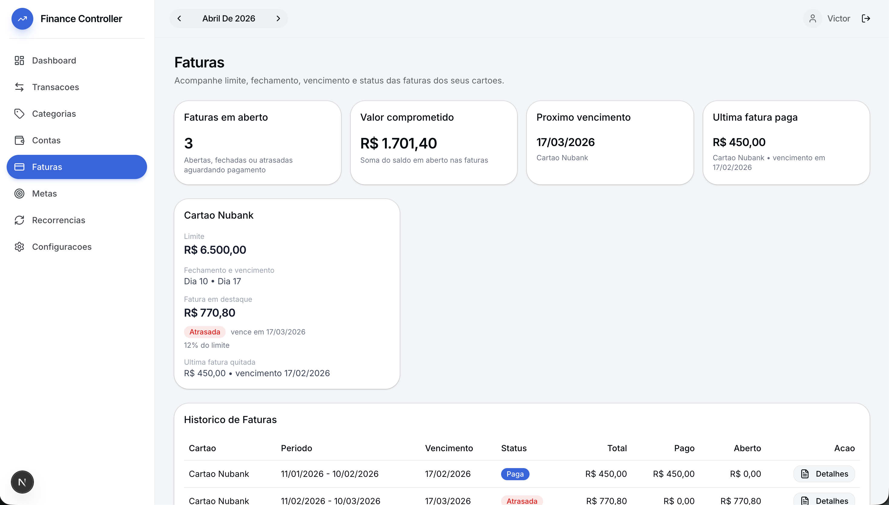
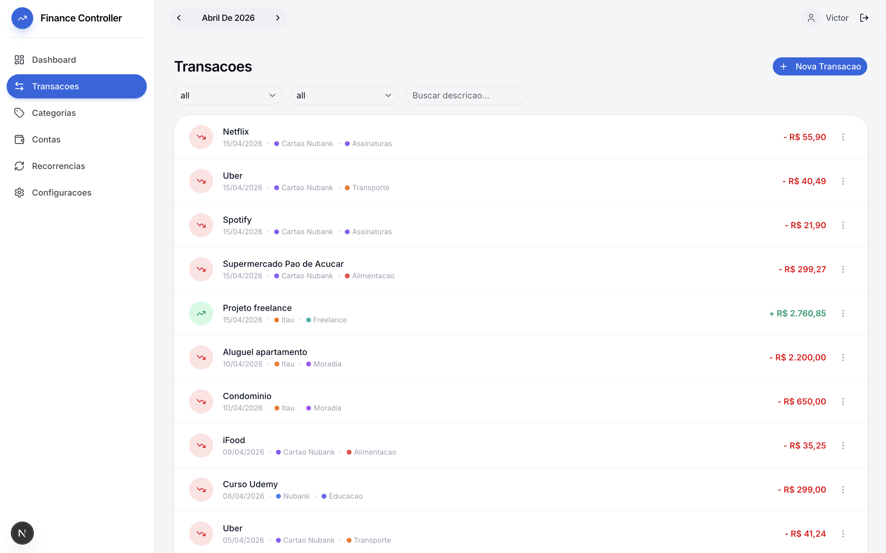
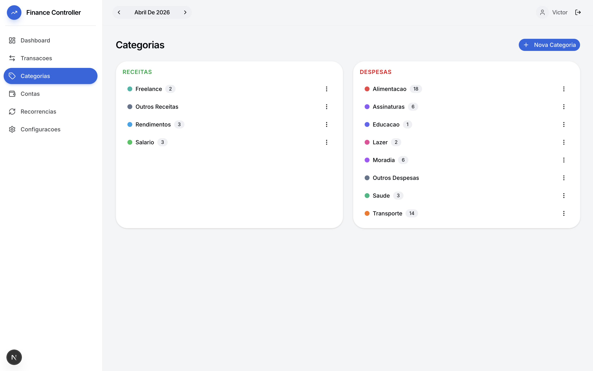
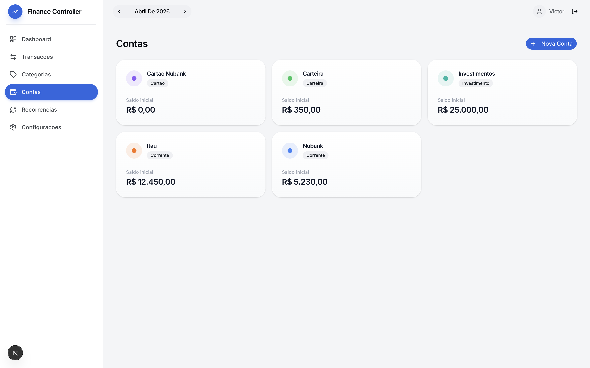
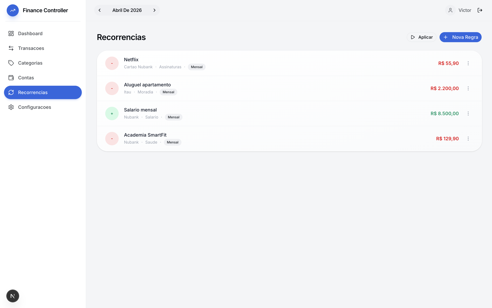
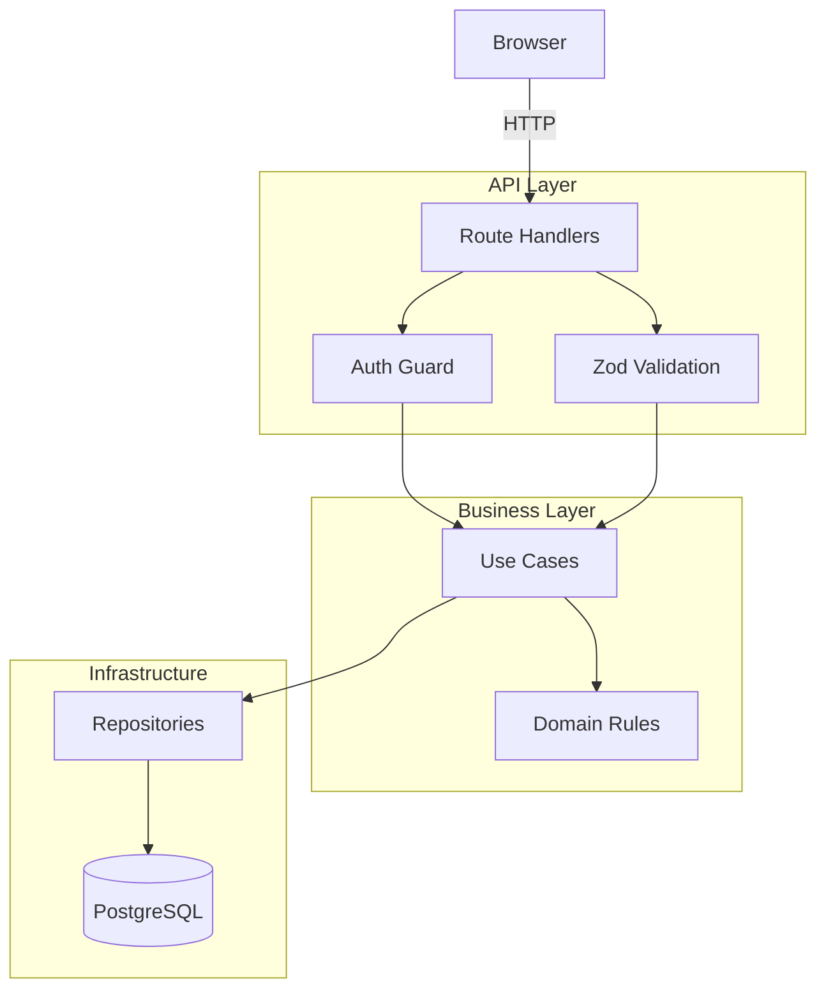
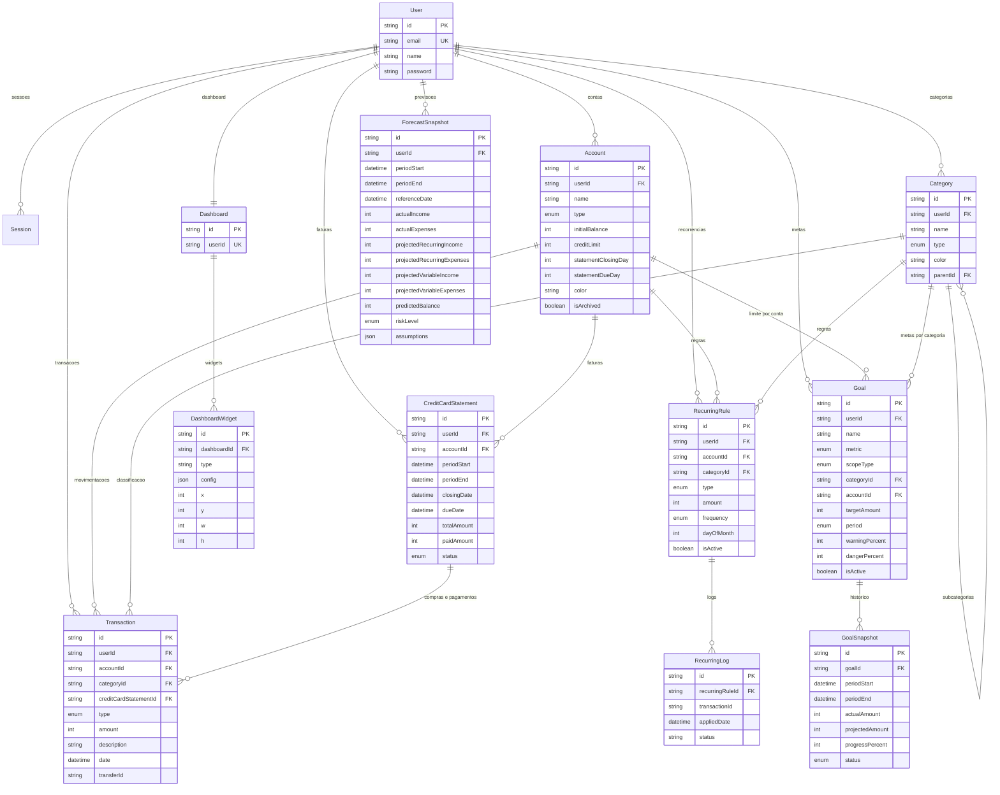

# Finance Controller


Sistema fullstack de gestao financeira pessoal, focado em controle, visualizacao e tomada de decisao.

> Organize sua vida financeira com clareza, performance e autonomia.

**Demo**: `demo@finance.com` / `demo1234` — execute `npx prisma db seed` para popular o banco.

---

## Preview

<p align="center">
  
</p>

<p align="center">
  
</p>

<p align="center">
  
  
</p>

<p align="center">
  
  
</p>

<p align="center">
  
  
</p>

---

## Problema

Gerenciar financas pessoais geralmente envolve:

- Planilhas manuais propensas a erro e sem estrutura
- Multiplas plataformas que nao conversam entre si
- Falta de visualizacao clara dos gastos e tendencias
- Categorizacao rigida que nao reflete a vida real

## Solucao

O Finance Controller centraliza tudo em uma unica aplicacao:

- Receitas, despesas e transferencias entre contas
- Categorias customizaveis e hierarquicas
- Dashboard visual e customizavel com drag-and-drop
- Recorrencias automaticas (salario, aluguel, assinaturas)
- Multi-contas com tipos distintos (corrente, cartao, investimento)

---

## Funcionalidades

- **Dashboard customizavel** — drag-and-drop de widgets com react-grid-layout, layout persistido por usuario
- **Multi-contas** — corrente, carteira, poupanca, cartao de credito, investimento
- **Categorias hierarquicas** — receitas e despesas com subcategorias, cores e contagem de transacoes
- **Transacoes** — CRUD completo com filtros por tipo, categoria e busca por descricao
- **Transferencias atomicas** — par de transacoes vinculadas por `transferId` (debito na origem, credito no destino)
- **Recorrencias** — regras com frequencia (diaria, semanal, mensal, anual), apply idempotente com logs
- **Billing de cartao de credito** — limite, fechamento, vencimento, faturas e pagamento parcial/total
- **Goal Engine** — metas de economia, limite de gasto, meta de receita e limite por conta/cartao, com calculo de progresso por periodo, status (no ritmo, atencao, em risco, atingida, ultrapassada) e snapshots historicos
- **Forecast Engine** — previsao do fechamento do mes combinando realizado, recorrencias futuras, projecao variavel (media movel) e faturas em aberto, com classificacao de risco e breakdown audit das premissas
- **Autenticacao segura** — bcrypt, sessoes server-side, cookies HttpOnly, rate limiting
- **Analytics** — resumo mensal com variacao percentual, gastos por categoria, saldo por conta, patrimonio total
- **Snapshot e invalidacao** — estrategia central de tags por usuario/modulo/mes, invalidada em mutacoes financeiras
- **Tema refinado** — design inspirado em Apex Holdings (Inter font, cantos arredondados, sombras suaves, gradientes sutis)
- **Seed demo** — dados ficticios realistas + botao de reset em `/settings`, com fatura paga, outra em aberto e 3 metas demo

---

## Arquitetura

O projeto segue uma **arquitetura em camadas** com separacao clara de responsabilidades:



### Principios

- **Route Handlers sao adaptadores** — validam input (Zod), verificam sessao, chamam use case, retornam Response
- **Logica de negocio nos use cases e domain** — nunca nos route handlers
- **Repository pattern** — `TransactionRepository`, `CategoryRepository`, etc.
- **Multi-tenant por padrao** — toda tabela financeira tem `userId`, toda query filtra por `userId`
- **Valores em centavos** — inteiros para evitar floating-point (R$ 150,75 = `15075`)

---

## Estrutura de Pastas

```
src/
  app/
    (public)/              Landing page
    (auth)/                Login, Register
    (app)/                 Paginas autenticadas
      dashboard/           Dashboard customizavel
      transactions/        Listagem e CRUD
      categories/          Receitas e despesas
      accounts/            Multi-contas
      credit-cards/        Faturas e pagamento de cartao
      recurring/           Regras recorrentes
      goals/               Metas financeiras e progresso
      settings/            Configuracoes + reset demo
    api/                   28 Route Handlers
      auth/                login, register, logout, me
      accounts/            CRUD + [id]
      categories/          CRUD + [id]
      transactions/        CRUD + [id] + transfer
      analytics/           summary + forecast + forecast/recalculate
      credit-cards/        statements, detail, payments
      dashboard/           widgets, layout
      recurring/           rules, apply, logs
      goals/               CRUD + [id] de metas
  server/
    auth/                  Sessions, hashing, guards, rate-limit
    modules/finance/
      domain/              Entidades e regras de negocio
      application/         analytics + credit-card billing + goals + forecast
      infra/               Repositorios Prisma
      http/                DTOs e validators Zod
  components/
    ui/                    shadcn/ui (Base UI)
    layout/                Sidebar, Topbar, AppShell
  lib/                     Utilitarios (formatCurrency, cn)
  hooks/                   Custom hooks (usePeriod)
  types/                   Tipos TypeScript compartilhados
prisma/                    Schema + migrations + seed
.docs/                     Documentacao viva (ADRs, tasks, changelog)
```

---

## Stack e Decisoes Tecnicas

| Camada         | Tecnologia                             |
| -------------- | -------------------------------------- |
| Framework      | Next.js 16 (App Router)                |
| Linguagem      | TypeScript                             |
| Estilizacao    | Tailwind CSS v4 + shadcn/ui            |
| Banco de Dados | PostgreSQL                             |
| ORM            | Prisma 7                               |
| Validacao      | Zod                                    |
| Graficos       | Recharts                               |
| Dashboard      | react-grid-layout                      |
| Auth           | Custom (bcrypt + server-side sessions) |
| CI             | GitHub Actions                         |

### Por que essas escolhas?

**Next.js 16 (App Router)** — Server Components para performance, layouts aninhados para UX complexa, e route handlers como camada HTTP fina. Deploy simplificado na Vercel.

**PostgreSQL + Prisma 7** — Consistencia relacional e essencial para dados financeiros. Prisma oferece type-safety, migrations versionadas e gerador de client com inferencia completa.

**Tailwind CSS v4 + shadcn/ui** — Design system consistente com componentes acessiveis (Radix). Utility-first para velocidade sem sacrificar qualidade visual.

**Zod** — Schema validation unificada: mesmos schemas validam forms no frontend e inputs na API, com inferencia automatica de tipos TypeScript.

**Valores em centavos (inteiros)** — Evita problemas classicos de floating-point em calculos financeiros. R$ 150,75 armazenado como `15075`.

**Sessoes server-side** — Controle total sobre sessoes sem depender de provedores. Cookies HttpOnly + rate limiting para seguranca.

**react-grid-layout** — Dashboard customizavel com drag-and-drop e resize. Layout persistido no banco por usuario.

---

## Fluxos Principais

### Criacao de Transacao

```
1. Usuario preenche formulario (valor, categoria, conta, data)
2. Frontend envia POST /api/transactions
3. Route Handler valida input com Zod + verifica sessao
4. Use Case aplica regras de negocio
5. Repository persiste no PostgreSQL
6. Resposta retorna transacao criada
```

### Transferencia entre Contas

```
1. Usuario seleciona conta origem, destino e valor
2. POST /api/transactions/transfer
3. Use Case cria par de transacoes (EXPENSE na origem + INCOME no destino)
4. Ambas vinculadas pelo mesmo transferId
5. Saldos atualizados automaticamente
```

### Recorrencias

```
1. Usuario cria regra (Netflix mensal, salario, aluguel)
2. Clica em "Aplicar" ou sistema aplica automaticamente
3. Use Case verifica regras pendentes no periodo
4. Cria transacoes com controle de idempotencia (RecurringLog)
5. Nenhuma transacao duplicada mesmo se aplicar multiplas vezes
```

### Dashboard

```
1. GET /api/analytics/summary?month=2026-04
2. Backend calcula: saldo total, receitas, despesas, variacao mensal
3. Agrupa gastos por categoria e saldo por conta
4. Frontend renderiza widgets no grid customizavel
5. Usuario reorganiza widgets com drag-and-drop, layout e salvo
```

---

## Banco de Dados

13 models, 9 enums (incluindo `GoalMetric`, `GoalScopeType`, `GoalPeriod`, `GoalStatus`, `ForecastRiskLevel`):



**Tipos de conta**: Carteira, Corrente, Poupanca, Cartao de Credito, Investimento, Outro

**Tipos de transacao**: Receita, Despesa, Transferencia

**Frequencias**: Diaria, Semanal, Mensal, Anual

**Status de fatura**: Aberta, Fechada, Paga, Atrasada

**Metricas de meta**: Economia (SAVING), Limite de gasto (EXPENSE_LIMIT), Meta de receita (INCOME_TARGET), Limite por conta (ACCOUNT_LIMIT)

**Status de meta**: No ritmo, Atencao, Em risco, Atingida, Ultrapassada

**Nivel de risco de previsao**: Low (folga), Medium (saldo apertado), High (saldo negativo)

---

## Como Rodar

### Pre-requisitos

- Node.js 18+
- PostgreSQL
- npm

### Setup

```bash
# Clonar
git clone git@github.com:Senavictors/Finance-Controller.git
cd Finance-Controller

# Instalar dependencias
npm install

# Configurar ambiente
cp .env.example .env
# Editar .env com sua DATABASE_URL do PostgreSQL

# Criar tabelas
npx prisma migrate dev

# Popular com dados demo
npx prisma db seed

# Gerar client Prisma
npx prisma generate

# Rodar em desenvolvimento
npm run dev
```

Acesse `http://localhost:3000`

### Comandos

```bash
npm run dev          # Dev server
npm run build        # Build producao
npm run lint         # ESLint
npm run format       # Prettier (write)
npm run format:check # Prettier (check)
npx prisma studio    # GUI do banco
npx prisma db seed   # Popular dados demo
```

---

## Roadmap

- [x] Phase 1: Fundacao (Next.js, Tailwind, Prisma, ESLint)
- [x] Phase 2: Autenticacao (bcrypt, sessions, guards)
- [x] Phase 3: Nucleo Financeiro (contas, categorias, transacoes, transferencias)
- [x] Phase 4: Dashboard MVP (graficos, analytics, redesign visual)
- [x] Phase 5: Dashboard Customizavel (react-grid-layout, widgets)
- [x] Phase 6: Recorrencias (regras, apply idempotente, logs)
- [x] Phase 7: Portfolio (seed demo, CI, README)
- [x] Phase 8: Fundacao analitica + billing de cartao
- [x] Phase 8.5: Demo and Portfolio Hardening
- [x] Phase 9: Goal Engine
- [x] Phase 10: Forecast Engine
- [ ] Phase 11: Financial Score
- [ ] Phase 12: Automatic Insights
- [ ] Import/export CSV
- [ ] Relatorios e exportacao PDF
- [ ] PWA / responsivo mobile

---

## Autor

**Victor Sena** — Desenvolvedor Fullstack

[](https://github.com/Senavictors)

---

## Licenca

Projeto pessoal de portfolio.
